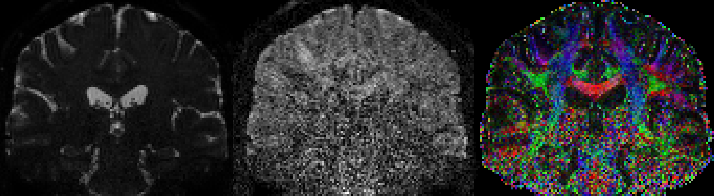
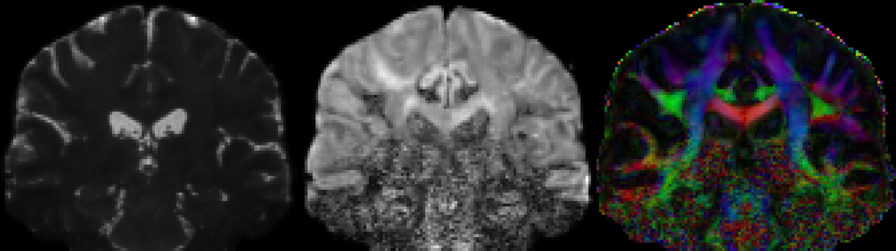

Denoising a small example dataset
----------------------------------

This tutorial shows how to denoise a crop of the 1.2 mm dataset
[(Full dataset also available)](https://github.com/samuelstjean/nlsam_data).
I also assume you have installed NLSAM and everything is running fine beforehand and have a brain mask for your data handy.
It makes processing far faster by skipping unnecessary voxels and more robust since we do not try to reconstruct noise in the process.
Also strongly suggested for your body or phantom experiments, since the sampling process only uses whatever is inside the mask.
Using the full extent of the data will likely pick up noise and lead to a poor(er) reconstruction.

This example will walk you through the required step to go from a noisy image like this



to the final denoised result like this



We also showcase some advanced options for highly noisy datasets, but for your regular
everyday processing the default options should work just fine.

# Table of Contents
1. [Prerequisite](#prerequisite)
2. [Processing steps](#steps)
3. [The result](#result)

<a name="prerequisite"></a>
## 1. Prerequisite

You will need a set of diffusion weighted images, a (binary) brain mask (such as from FSL BET or anything similar) and the associated bvals/bvecs files as used by FSL.

<a name="steps"></a>
## 2. Processing steps

#### 2.1 Correcting the noise bias

Once installed, the first processing step allows you to transform the data to Gaussian distributed
signals if your dataset is Rician or Noncentral chi distributed.

Of course if your dataset is already bias corrected or you would like to use another method for noise estimation,
you can skip this step and proceed to the denoising itself by passing the option **--no_stabilization**.
The correction for Rician or Noncentral chi distributed noise would then be left to any other method of your choosing.

#### 2.2 Required command line inputs

There are 4 required command line inputs (their order is important) and a switch for the mask which are

+ The input dataset (dwi.nii.gz)
+ The output dataset (dwi_nlsam.nii.gz)
+ The b-values file for our input dataset (bvals)
+ The b-vectors file for our input dataset (bvecs)
+ -m or --mask mask.nii.gz for the brain mask

The bvals/bvecs files are needed for identifying the angular neighbors and we need to choose how many we want to denoise at once (the default is now 5).

Using a larger number could mean more blurring if we mix q-space points which are too far part.

For a multishell acquisition, only the direction (as opposed to the norm)
of the b-vector is taken into account, so you can freely mix dwi from different
shells to favor picking radial decay in the denoising.

There is also a new option called **--split_shell** to process each shell by itself separately and **--split_b0s** to process the b0s separately in each block.

#### 2.3 Advanced options

More options are available for various advanced usage, which can be viewed with **nlsam_denoising --help**.
Some are mostly useful for debugging and saving intermediate steps, such as **--verbose** for
printing various useful information or **--log logfile.txt** for processing a large number of file
and saving the various outputs.

Feel free to check them out if you want finer grained controls over the denoising process.

#### 2.4 Example call to the nlsam_denoising script

Finally, the required call to the nlsam_denoising script for this example would be

```bash
nlsam_denoising dwi.nii.gz dwi_nlsam.nii.gz bvals bvecs -m mask.nii.gz --verbose
```

The script will output the time taken at each denoising iterations so you can ballpark estimate the total time required.
On my old computer (an intel xeon quad core at 3.5 GHz, much faster than the one reported originally in the paper),
it took around 40 s per iteration for this example, for a total of 8 minutes.

<a name="result"></a>
## 3. The result

At the end, you can continue your regular diffusion MRI pipeline with the denoised version of the dataset,
here named dwi_nlsam.nii.gz for the purposes of this example.

From an input noisy image


This is the final, NLSAM denoised result


