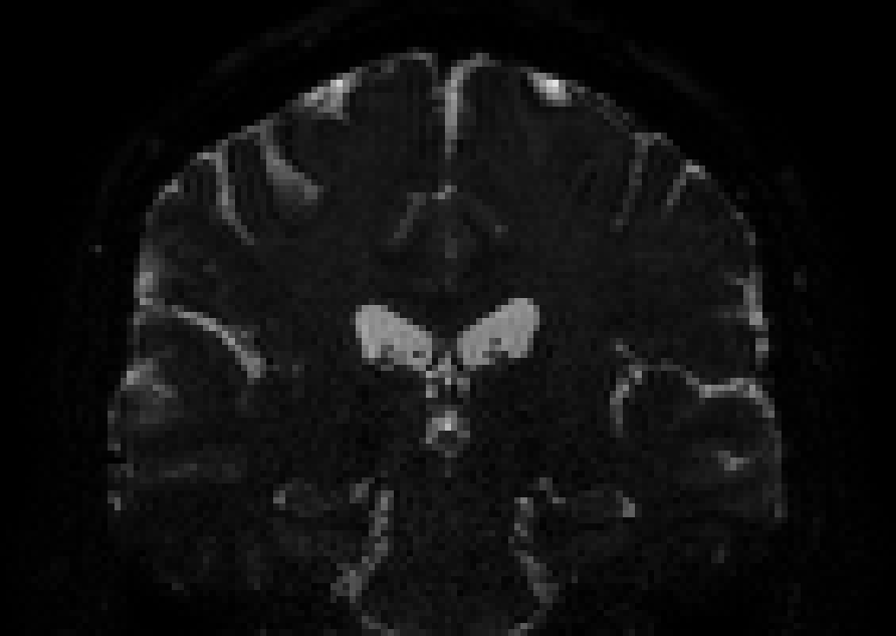
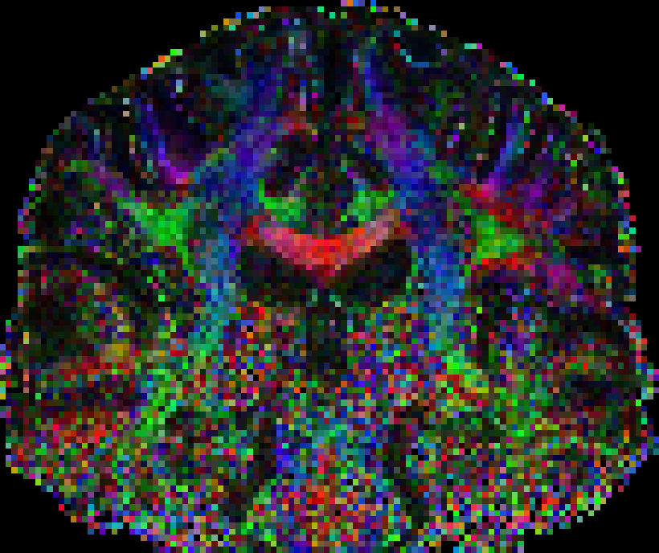
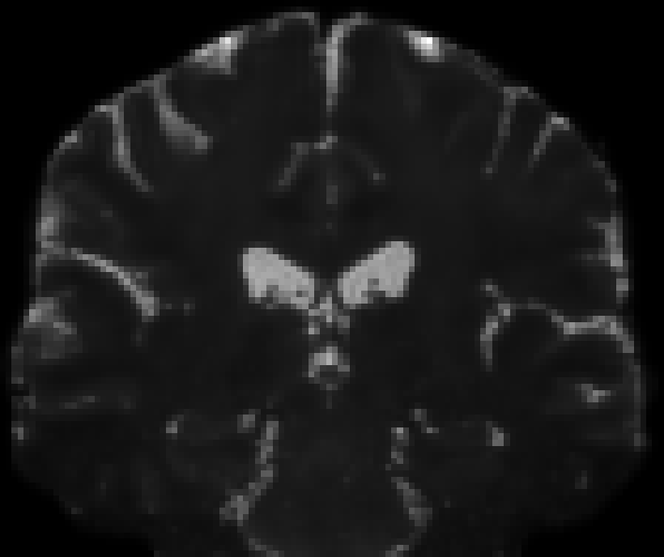
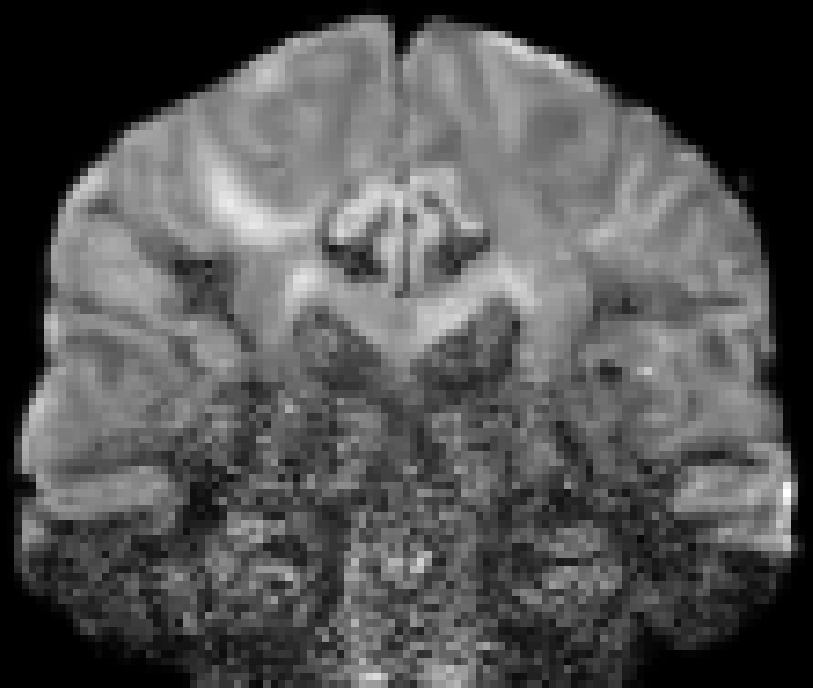
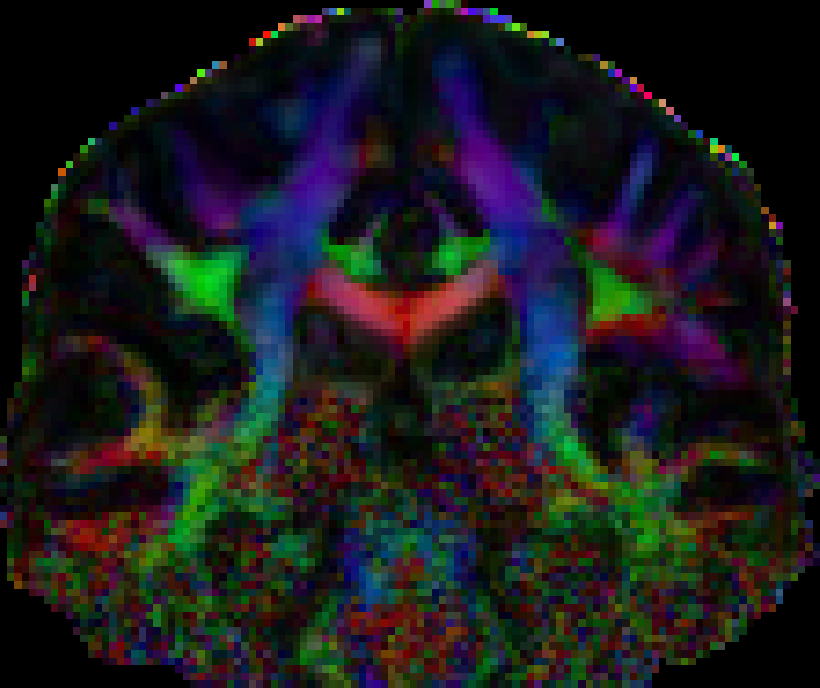

Denoising a small example dataset
----------------------------------

This tutorial shows how to denoise a crop of the 1.2 mm dataset [(Full dataset)](https://github.com/samuelstjean/nlsam_data).
I also assume you have installed NLSAM and everything is running fine beforehand.

## 0. Prerequisite

#### 0.1 Get a binary mask of the brain

This will reduce the computation time by only denoising the voxels which are included inside the mask.
For this example, I used bet2 from fsl to create mask.nii.gz using only the b0 image, but feel free to use your favorite tool of course.

```bash
bet2 b0.nii.gz brain -m -f 0.1
```

#### 0.2 Minimally required data for processing

You will need a set of diffusion weighted images and the associated bvals/bvecs files as used by FSL.

If your data if not in the bvals/bvecs format, you will need to convert it.
Your favorite diffusion MRI processing tool probably has a function to help you with the conversion
(Scilpy, MRtrix3 and ExploreDTI all offer options for this conversion for example).

## 1. Correcting the noise bias and computing the standard deviation

Once installed, there are two main scripts, the stabilization algorithm and the NLSAM algorithm itself.
The first one allows you to transform the data to Gaussian distributed signals if your dataset is Rician or Noncentral chi distributed.

Of course if your dataset is already bias corrected or you would like to use another method for noise estimation,
you can skip this step and proceed to the denoising itself by supplying you own noise standard deviation estimate.
The correction for Rician or Noncentral chi distributed noise would then be left to any other method of your choosing.

#### 1.1 Required command line inputs

A typical example call requires only a diffusion weighted dataset (dwi.nii.gz) and the number of coils from the acquisition (N),
but it is recommended to also have a brain mask (mask.nii.gz) to greatly reduce computation time.

For this example dataset, we used a SENSE reconstruction (Philips, GE), which leads to spatially varying Rician noise, so we set N = 1.
If your scanner instead implements a GRAPPA reconstruction (Siemens), you would need to specify N as the number of coils in the acquisition.
While this value can be difficult to estimate, asking help from your friendly MR physicist is advised (or check subsection 1.1a).

In the meantime, you can still run the algorithm with N = 1 to use a Rician correction and check the result, in which case there would be a slight intensity
bias left in the image, but which would be lower than not correcting it in the first place.

There will be two output from running the script, the bias corrected dataset (dwi_stab.nii.gz) and the noise standard deviation (sigma.nii.gz).

##### 1.1a Advanced techniques for estimating N (optional topic)

This section is mostly personal recommendations based on some literature, stuff I have played with
and stuff I have seen in MR physics classes. It is probably not exhaustive nor perfectly accurate,
but should give the interested reader a feeling of what is happening and why.

Of course feel free to continue to section 1.2 if this seems a bit complicated for the matter at hand.

For those that are still with me, noise estimation in MR highly depends on
the reconstruction algorithm implemented by your vendor [1]. Unfortunately,
due to interference between adjacent receiver coils as used in modern parallel imaging
(i.e. pretty much always unless you are doing fancy specialized acquisitions),
the real noise distribution is slightly different than a pure Rician or
Noncentral chi distribution [2]. It is still possible to estimate the distribution,
but the values of the 'standard deviation' and degrees of freedom of that distribution
depends on the parameters of the acquisition (i.e. SENSE maps, GRAPPA weights),
which are probably hard to acquire if you do not have a friendly MR physicist
(they are always nice guys anyway, so don't be afraid to ask for help) at hand.
The authors of [2] still offer a way to do a blind estimation of these values for
those interested to dig a bit more.

Also based on my MR physics class understanding, due to the way the (closed source)
algorithm in each vendor's scanner software work, they are likely to discard
the signal coming from far away receiver elements from the imaged body region.
As an example, near the top of the head, the coil elements placed near the neck are very likely to measure
little relevant signal and mostly contribute noise and as such will be discarded
from the k-space reconstruction, thus making the noise distribution vary in
nature across the image space and have a lower value N than the real number of coils in
your antenna.

The authors of [3] also provided another way to estimate those
relevant parameters based on constructing synthetic noise maps for those
interested in trying another method.

As a final tl;dr advice, some other studies have found that for GRAPPA reconstruction,
with a 8 channels head coils N=4 [4] (that's what we use in Sherbrooke also
for the 1.5T Siemens scanner with a 12 channels head coil)
works well and for a 32 channels head coils [5], a value around N=9 seems to work
(remember that N varies spatially, but it seems to be fairly homogeneous/vary slowly).
The authors of [6] also indicates that in
the worst case, using N=1 for Rician noise is better than doing nothing.

In all cases, the take home message would be that estimating the real value for N
is still challenging, but it will most likely be lower than the number of coils.  

[1] Dietrich, O., Raya, J. G., Reeder, S. B., Ingrisch, M., Reiser, M. F., & Schoenberg, S. O. (2008).
Influence of multichannel combination, parallel imaging and other reconstruction
techniques on MRI noise characteristics. Magnetic Resonance Imaging

[2] Aja-Fernandez, S., Vegas-Sanchez-Ferrero, G., Tristan-Vega, A., 2014.
Noise estimation in parallel MRI: GRAPPA and SENSE.
Magnetic resonance imaging

[3] Veraart, J., Rajan, J., Peeters, R. R., Leemans, A., Sunaert, S., & Sijbers, J. (2013).
Comprehensive framework for accurate diffusion MRI parameter estimation.
Magnetic Resonance in Medicine

[4] Brion, V., Poupon, C., Riff, O., Aja-Fernández, S., Tristán-Vega, A., Mangin, J.-F., … Poupon, F. (2013).
Noise correction for HARDI and HYDI data obtained with multi-channel coils and sum
of squares reconstruction: an anisotropic extension of the LMMSE.
Magnetic Resonance Imaging

[5] Varadarajan, D., & Haldar, J. (2015).
A Majorize-Minimize Framework for Rician and Non-Central Chi MR Images.
IEEE Transactions on Medical Imaging

[6] Becker, S. M. A., Tabelow, K., Mohammadi, S., Weiskopf, N., & Polzehl, J. (2014).
Adaptive smoothing of multi-shell diffusion weighted magnetic resonance data by msPOAS.
NeuroImage

#### 1.2 Algorithms for noise estimation

To initialize the estimation from the stabilization algorithm, we will use a spherical harmonics fit (which is the default),
so we also supply the bvals/bvecs files to the script. In case you have few directions (per shell), you can deactivate this option
by passing --smooth no_smoothing

The default is to use a noise estimation based on piesno, but since this dataset is fairly noisy and has no background,
we will instead use an estimation based on the local standard deviation with the option --noise_est local_std

#### 1.3 Advanced options

More options are available, which can be viewed with stabilizer --help

#### 1.4 Example call to the stabilizer script

Finally, the required call to the stabilizer script for this example would be

```bash
stabilizer dwi.nii.gz dwi_stab.nii.gz 1 sigma.nii.gz -m mask.nii.gz --bvals bvals --bvecs bvecs --noise_est local_std
```

The script will print each step, which should complete fairly fast (a few minutes top).
As a example, the above script took around 10 s on my quad core 3.5 GHz computer and around 5 mins for the whole dataset.

## 2. Denoising the dataset

Once we have an estimation of the noise standard deviation, we can proceed to the denoising itself

#### 2.1 Required command line inputs

The input dataset will be the noisy Gaussian distributed version (dwi_stab.nii.gz) and the noise
standard deviation we computed (sigma.nii.gz). We also the bvals/bvecs files for identifying
the angular neighbors and need to choose how many we want to denoise at once.

Here I selected 5 as it is the number of dwis which are roughly equidistant on the sphere.
Using a larger number could mean more blurring if we mix q-space points which are too far part.

For a multishell acquisition, only the direction (as opposed ot the norm)
of the b-vector is taken into account, so you can freely mix dwi from different
shells to favor picking radial decay in the denoising.

#### 1.3 Advanced options

More options are available, which can be viewed with nlsam --help

#### 1.4 Example call to the nlsam script

Finally, the required call to the nlsam script for this example would be

```bash
nlsam dwi_stab.nii.gz dwi_nlsam.nii.gz 5 bvals bvecs sigma.nii.gz -m mask.nii.gz
```

The script will output the time taken at each iterations so you can estimate the total time required.
On my computer, it took around 40 s per iteration for this example, for a total of 8 minutes.

The full dataset required 23 mins per iteration, for a total processing time of 276 mins.
As a side note, using piesno resulted in an iteration taking only 8 mins,
so the whole dataset could be denoised in around ~100 mins with the default options.

## 3. The result

At the end, you can continue your regular diffusion MRI pipeline with the denoised version of the dataset,
here named dwi_nlsam.nii.gz for the purposes of this example.

From an input noisy image





This is the final, NLSAM denoised result




